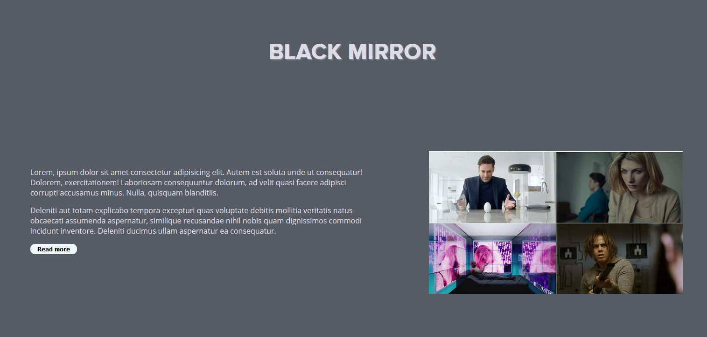

<h1>Proyecto fin de evaluación de Lenguajes de Marcas</h1>
<h2>Black Mirror - A tribute site</h2>

Trabajo realizado en clase por: Pilar González Augusto

Proyecto de web "from scratch" de 1ª evaluación de Lenguajes de Marcas

Diciembre de 2023 

Licencia CC-BY

<h2>Motivación</h2>

El tema lo he elegido porque ...

<h2>Estructura</h2>

La web está dividida en  X secciones:

<ul>
  <li>Hero Section</li>  
  <li>Introducción</li>
  <li>...</li>
  <li>Footer</li>
</ul>

<h3>Hero Section</h3>

He utilizado una imagen de fondo tomada de .... que se adapta fácilmente a diferentes dispositivos.... 
Sobre ella he colocado un Call to Action que he estilado a partir de .... 
(una breve explicación)

<h3>Introducción</h3>

He dispuesto en un grid de 2 columnas....

...

<h3>Footer</h3>

breve explicación 

